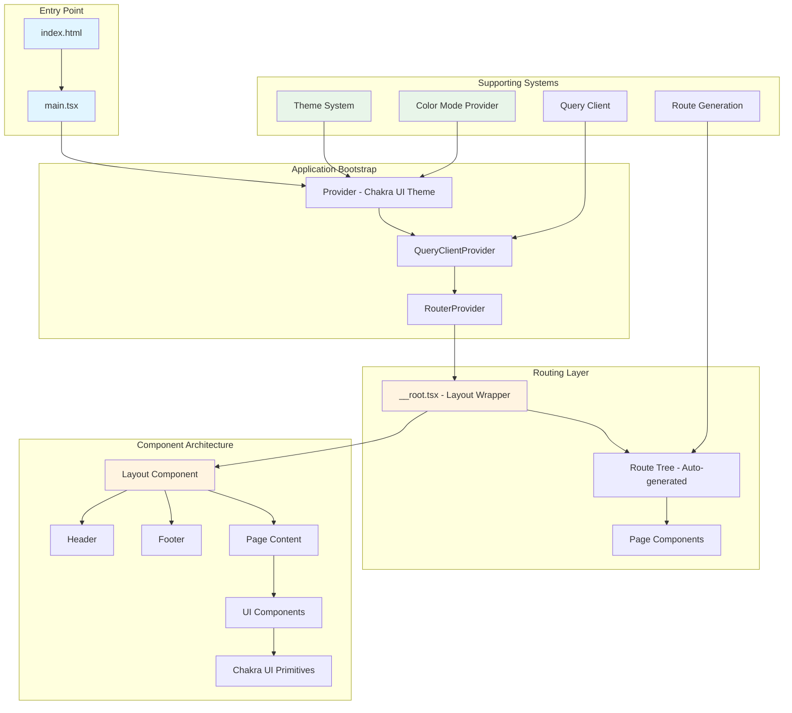

# Vite React Chakra Starter


A production-ready starter template for building React applications with Vite, TypeScript, Chakra UI v3, and TanStack Router. This template provides a modern development setup with file-based routing, state management, and comprehensive tooling.

[**Live Demo**](https://vite-react-chakra-starter.sznm.dev/)

[](https://vercel.com/import/git?s=https://github.com/agustinusnathaniel/vite-react-chakra-starter) [](https://app.netlify.com/start/deploy?repository=https://github.com/agustinusnathaniel/vite-react-chakra-starter)

[](https://stackblitz.com/github/agustinusnathaniel/vite-react-chakra-starter)

## Purpose and Scope

This template solves the problem of quickly bootstrapping a new React application with:
- Modern build tooling (Vite with Rolldown)
- Type-safe routing (TanStack Router)
- Component library (Chakra UI v3)
- Development tooling (Biome, Vitest, TypeScript)
- PWA capabilities (optional, disabled by default)

**What this template does not provide:**
- Backend API integration patterns
- Authentication/authorization flows
- Database or data persistence layer
- Complex state management (beyond React Query)
- Deployment pipelines (only configuration files)

## Tech Stack

| Category | Technology | Version | Purpose |
|----------|-----------|---------|---------|
| Build Tool | Vite (Rolldown) | 7.1.20 | Fast dev server and optimized builds |
| Framework | React | 19.2.0 | UI library |
| Language | TypeScript | 5.9.3 | Type safety |
| Routing | TanStack Router | 1.139.12 | File-based routing with type safety |
| UI Library | Chakra UI | 3.30.0 | Component system |
| State Management | TanStack Query | 5.90.11 | Server state management |
| Testing | Vitest | 4.0.14 | Unit and integration testing |
| Linting/Formatting | Biome | 2.3.2 | Code quality and formatting |
| Package Manager | pnpm | 10.24.0 | Fast, disk-efficient package management |

## Architecture Overview



## Repository Structure

```
vite-react-chakra-starter/
├── src/
│   ├── main.tsx                 # Application entry point
│   ├── routes/                  # TanStack Router route definitions
│   │   ├── __root.tsx           # Root layout route with meta tags
│   │   └── index.tsx            # Home page route
│   ├── routeTree.gen.ts         # Auto-generated route tree (DO NOT EDIT)
│   └── lib/                     # Application code
│       ├── components/          # Reusable UI components
│       │   └── ui/              # Base UI components (button, color-mode, provider)
│       ├── layout/              # Layout components
│       │   ├── index.tsx        # Main layout wrapper
│       │   └── components/      # Header, Footer, Meta
│       ├── pages/               # Page-level components
│       │   ├── home/            # Home page and its components
│       │   └── 404/             # 404 error page
│       ├── services/            # Services and shared constants
│       │   └── constants.ts     # Query client instance
│       ├── styles/              # Theme configuration
│       │   └── theme/           # Chakra UI theme setup
│       └── utils/               # Utility functions
│           ├── sample.ts        # Example utility
│           └── sample.test.ts   # Example test
├── public/                      # Static assets
├── vite.config.ts               # Vite configuration
├── vitest.config.ts             # Test configuration
├── tsconfig.json                # TypeScript configuration
├── biome.json                   # Linting and formatting rules
└── package.json                 # Dependencies and scripts
```

## Getting Started

### Prerequisites

- Node.js ^24.11.x
- pnpm 10.24.0

### Installation

```bash
# Clone or use template
npx degit agustinusnathaniel/vite-react-chakra-starter <app_name>
cd <app_name>

# Install dependencies
pnpm install

# Start development server
pnpm dev
```

The development server runs on `http://localhost:3000` and opens automatically.

## Development Workflows

### Running the Application

```bash
# Development server with hot reload
pnpm dev

# Production build preview
pnpm build
pnpm serve
```

### Code Quality

```bash
# Check code style and linting
pnpm biome:check

# Auto-fix issues
pnpm biome:fix

# Type checking
pnpm type:check

# Run all checks (lint, type, test)
pnpm check:turbo
```

### Testing

```bash
# Run tests once
pnpm test

# Run tests with UI
pnpm test:ui

# Run tests with coverage
pnpm test:coverage
```

### Building

```bash
# Production build
pnpm build

# Output directory: build/client
```

## Key Dependencies and Their Roles

### Core Framework

- **@tanstack/react-router**: File-based routing with type safety. Routes are defined in `src/routes/` and automatically generate a type-safe route tree.
- **@tanstack/react-query**: Server state management. Configured in `src/lib/services/constants.ts`.
- **@chakra-ui/react**: Component library with design tokens. Theme configured in `src/lib/styles/theme/`.

### Development Tools

- **@tanstack/router-plugin**: Vite plugin that generates route trees and enables code splitting.
- **@tanstack/devtools-vite**: Development tools for debugging Router and Query.
- **vite-plugin-checker**: TypeScript type checking during development (disabled in production).
- **vite-tsconfig-paths**: Enables TypeScript path aliases (`@/*`) in Vite.

### Build Configuration

- **rolldown-vite**: Experimental Vite build using Rolldown (Rust-based bundler) for faster builds.
- **vite-plugin-pwa**: PWA support (currently disabled, see `vite.config.ts`).

## Configuration Files

| File | Purpose |
|------|---------|
| `vite.config.ts` | Vite build configuration, plugins, dev server settings |
| `vitest.config.ts` | Test runner configuration, coverage settings |
| `tsconfig.json` | TypeScript compiler options, path aliases |
| `biome.json` | Linting rules, formatting preferences, file patterns |
| `commitlint.config.ts` | Commit message conventions (Conventional Commits) |
| `turbo.json` | Task dependencies and caching for CI/CD |

## Path Aliases

The project uses TypeScript path aliases configured in `tsconfig.json`:

- `@/*` → `src/*`

Example: `import { Button } from '@/lib/components/ui/button'`

## Deployment

### Build Output

- **Command**: `pnpm build`
- **Output Directory**: `build/client`

### Platform-Specific Configuration

- **Vercel**: `vercel.json` - React Router preset configuration
- **Netlify**: `netlify.toml` - React Router framework configuration
- **Nixpacks**: `nixpacks.toml` - Container build configuration

See platform-specific documentation:
- [Vercel React Router Guide](https://vercel.com/docs/frameworks/react-router#vercel-react-router-preset)
- [Netlify React Router Guide](https://docs.netlify.com/frameworks/react-router/)

## Common Development Tasks

### Adding a New Route

1. Create a file in `src/routes/` (e.g., `src/routes/about.tsx`)
2. Use `createFileRoute` to define the route
3. The route tree is auto-generated on save

```tsx
import { createFileRoute } from '@tanstack/react-router';

export const Route = createFileRoute('/about')({
  component: About,
});
```

### Adding a New Page Component

1. Create a directory in `src/lib/pages/`
2. Create `index.tsx` with the page component
3. Import and use in route file

### Adding a New UI Component

1. Create component in `src/lib/components/ui/` or appropriate subdirectory
2. Follow existing patterns (forwardRef for DOM components, proper TypeScript types)
3. Export from component file

### Modifying Theme

Edit `src/lib/styles/theme/index.ts` to customize Chakra UI tokens, colors, and design system values.

## References

- [Vite Documentation](https://vitejs.dev)
- [Chakra UI Documentation](https://chakra-ui.com/)
- [TanStack Router Documentation](https://tanstack.com/router)
- [TanStack Query Documentation](https://tanstack.com/query)
- [TypeScript Documentation](https://www.typescriptlang.org)
