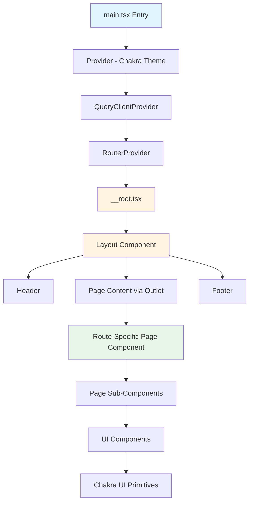
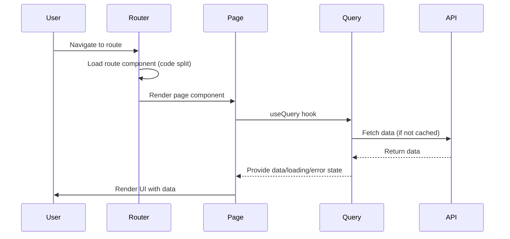

# System Specification

This document defines the system-level specification, core concepts, invariants, and constraints for the Vite React Chakra Starter template.

## Problem Statement

This template provides a production-ready starting point for React applications that need:
- Fast development iteration with hot module replacement
- Type-safe routing with file-based route definitions
- Modern UI component library with design system
- Server state management out of the box
- Comprehensive development tooling

## Core Concepts

### File-Based Routing

Routes are defined as files in `src/routes/`. The TanStack Router plugin generates a type-safe route tree automatically.

**Invariant**: Route file paths map directly to URL paths (with `__root.tsx` as the root layout).

**Example**:
- `src/routes/index.tsx` → `/`
- `src/routes/about.tsx` → `/about`
- `src/routes/posts/$postId.tsx` → `/posts/:postId`

### Component Hierarchy

**Invariant**: All routes render through `__root.tsx`, which provides the Layout wrapper.

### Theme System

The theme is configured using Chakra UI's `createSystem` API and extends the default configuration.

**Invariant**: Theme is provided at the root level via `Provider` component. All Chakra components inherit theme tokens.

**Configuration Location**: `src/lib/styles/theme/index.ts`

**Customization**: Modify theme tokens (fonts, colors, spacing) in the theme configuration file.

### Color Mode

Color mode (light/dark) is managed by `next-themes` and integrated with Chakra UI.

**Invariant**: Color mode state persists in localStorage via `ThemeProvider`.

**Implementation**: `src/lib/components/ui/color-mode.tsx`

**Usage**: Components use `useColorMode()` hook to access and toggle color mode.

### Query Client

TanStack Query client is instantiated once and provided at the root level.

**Invariant**: Single QueryClient instance shared across the application.

**Location**: `src/lib/services/constants.ts`

**Configuration**: Default query options can be modified in the QueryClient constructor.

## Expected Behaviors

### Route Loading

1. Routes are code-split automatically by TanStack Router plugin
2. Route components load on-demand when navigated to
3. Preloading occurs on `intent` (hover/focus) by default
4. Scroll restoration is enabled by default

### Development Server

1. Vite dev server runs on port 3000
2. Browser opens automatically on start
3. Hot module replacement (HMR) updates components without full page reload
4. Type checking runs in development (disabled in production builds)

### Build Process

1. TypeScript compilation runs before build
2. Vite bundles application with code splitting
3. Route-based code splitting is automatic
4. Output directory: `build/client`

### Error Handling

1. 404 routes render `Page404` component (defined in `src/lib/pages/404/`)
2. Route errors are caught by router's error boundary
3. Query errors are handled by TanStack Query error boundaries

## Constraints

### TypeScript

- **Strict Mode**: Enabled with `strictNullChecks`
- **No `any`**: Avoid `any` types (not enforced by compiler, but expected)
- **Path Aliases**: Must use `@/*` for `src/` imports
- **Module Resolution**: `Bundler` mode (Vite-compatible)

### File Naming

- **Routes**: kebab-case file names map to URL paths
- **Components**: kebab-case file names (enforced by Biome)
- **Pages**: `index.tsx` for page entry points

### Import Rules

- **No Barrel Files**: Biome disallows barrel file patterns (performance)
- **Import Organization**: Automatic sorting by Biome
- **Path Aliases**: Required for `src/` imports

### Component Exports

- **Default Exports**: Only allowed for:
  - Route files (`src/routes/**/*.tsx`)
  - Page components (`src/lib/pages/**/index.tsx`)
  - Entry/config files (`src/*.ts`, `*.ts`)
- **All Other Files**: Must use named exports

## Non-Goals

This template intentionally does not provide:

1. **Backend Integration**: No API client setup, authentication flows, or data fetching patterns
2. **State Management**: No global state management beyond React Query (no Zustand, Redux, etc.)
3. **Form Handling**: No form library or validation setup
4. **Testing Utilities**: Minimal test setup (Vitest only, no React Testing Library configured)
5. **Storybook**: No component documentation tooling
6. **i18n**: No internationalization setup
7. **E2E Testing**: No Playwright, Cypress, or similar
8. **Docker**: No containerization setup (Nixpacks config provided for platforms that use it)

## Trade-offs

### Build Tool: Rolldown vs Standard Vite

**Choice**: Uses `rolldown-vite` (experimental Rust-based bundler)

**Trade-off**: Faster builds, but experimental. May have compatibility issues with some plugins.

**Alternative**: Can switch to standard Vite by changing `vite` dependency in `package.json`.

### Router: TanStack Router vs React Router

**Choice**: TanStack Router for type safety and file-based routing

**Trade-off**: More opinionated, requires plugin setup. Better DX but less ecosystem maturity than React Router.

### UI Library: Chakra UI v3 vs v2

**Choice**: Chakra UI v3 (new architecture)

**Trade-off**: Modern API, better performance, but different from v2 (breaking changes). Smaller ecosystem of v3-specific resources.

### Linter: Biome vs ESLint

**Choice**: Biome for all-in-one linting and formatting

**Trade-off**: Faster, simpler config, but less ecosystem plugins than ESLint. Some ESLint rules not available.

## Known Limitations

### PWA Support

PWA plugin is configured but **disabled by default** (`disable: true` in `vite.config.ts`). To enable:
1. Set `disable: false` in PWA options
2. Configure service worker behavior
3. Update manifest settings

### Route Tree Generation

The route tree (`routeTree.gen.ts`) is auto-generated and should not be manually edited. If routes don't appear:
1. Check file naming matches expected patterns
2. Verify `createFileRoute` is used correctly
3. Restart dev server if generation seems stuck

### Type Checking in Production

Type checking is disabled during production builds for performance. Always run `pnpm type:check` before committing.

### Test Coverage Scope

Test coverage is configured only for `src/lib/utils/**`. Other directories are not included in coverage reports by default.

## Edge Cases

### Color Mode Hydration

Color mode uses `ClientOnly` wrapper for the toggle button to avoid hydration mismatches. The theme provider handles SSR correctly, but UI that depends on resolved theme should use `ClientOnly` or handle loading states.

### Route Preloading

Routes preload on `intent` (hover/focus). This can cause unexpected network requests. To disable, modify `defaultPreload` in `main.tsx` router configuration.

### Build Output Structure

Vite outputs to `build/client/` (not `dist/`). This is configured for TanStack Router compatibility with deployment platforms.

### Path Alias Resolution

Path aliases (`@/*`) work in source files but not in:
- Config files (`vite.config.ts`, `vitest.config.ts`)
- `biome.json` file patterns
- Other non-TypeScript files

Use relative paths in these contexts.

## Data Flow

## Invariants Summary

1. **Single QueryClient**: One instance shared application-wide
2. **Route Tree**: Auto-generated, never manually edited
3. **Theme Provider**: Must wrap entire application
4. **Layout**: All routes render through `__root.tsx` → `Layout`
5. **Path Aliases**: Required for `src/` imports in source files
6. **File Naming**: kebab-case enforced by Biome
7. **Export Style**: Named exports except for routes, pages, entry files
8. **Type Safety**: Strict TypeScript with no `any` types expected

## Runtime Assumptions

1. **Browser Environment**: Requires modern browser with ES module support
2. **Node Version**: Node.js ^24.11.x (enforced by `engines` in `package.json`)
3. **Package Manager**: pnpm 10.24.0 (enforced by `packageManager`)
4. **Build Output**: Deployed as static files (SPA routing handled by platform)

## Configuration Assumptions

1. **Port**: Dev server uses port 3000 (configurable in `vite.config.ts`)
2. **Base Path**: Assumes root deployment (`/`). For subpaths, configure `base` in Vite config and router.
3. **Environment**: No environment variable setup by default (can be added via Vite's `import.meta.env`)

